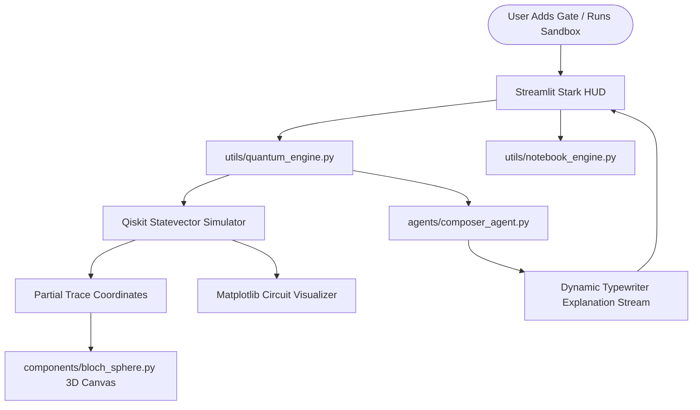

# 🌌 Stark Quantum Console (A.C.E. Edition)
### An Immersive, Physics-First Quantum Composer and Multi-Agent Workspace

The **Stark Quantum Console** is a fully open-source, highly cloneable framework designed to teach Quantum Computing and the Qiskit framework visually and intuitively. Built to replicate the core mechanics of the **IBM Quantum Composer** inside a premium Stark Industries holographic HUD, the backend is driven by a swarm of specialized AI agents explaining the physical shifts in real-time.

---

## 🚀 Key Features

- 🎛️ **Stark Composer mainboard:** A state-tracking gate compiler that simulates circuits in real-time, supporting custom gates (`H`, `X`, `Y`, `Z`, `CNOT`) on multiple qubits.
- 🔮 **Dual 3D Bloch Spheres:** CDN-backed, lightweight Three.js canvas projections. Calculates coordinates via partial tracing density matrices to physically spin the state vectors in 3D as gates are applied.
- 🎨 **Dynamic Dark-Theme Circuits:** Dynamically generates high-fidelity, custom dark-styled Qiskit circuit diagrams on-the-fly using matplotlib.
- 💬 **Warm AI Companion Interceptors:** An Advanced Conceptual Explainer (A.C.E.) agent that intercepts composer events to explain the exact physical mechanism of your actions in real-time typewriter streams.
- 💻 **Integrated Sandbox Notebook:** A safe Python sandboxed environment where you can type raw Qiskit code, execute it locally, capture print statements (`stdout`/`stderr`), and view drawn figures instantly.

---

## 🛠️ Local Installation & Setup

Ensure you have **Python 3.10+** installed.

```bash
# 1. Clone the repository
git clone https://github.com/yourusername/Qiskit-Intuition.git
cd Qiskit-Intuition

# 2. Create and activate a virtual environment
python3 -m venv venv
source venv/bin/activate  # On Windows: venv\Scripts\activate

# 3. Install required dependencies
pip install -r requirements.txt

# 4. Set up your Google Gemini API Key
# Create a .env file in the root folder and add your key:
echo "GEMINI_API_KEY=your_actual_api_key" > .env

# 5. Launch the Stark HUD mainboard!
streamlit run app.py
```
Open **[http://localhost:8502](http://localhost:8502)** in your browser.

---

## 🧠 Architectural Design (Multi-Agent Swarm)



---

## 🎨 Note for Frontend Developers (Building a Drag-and-Drop React/Next.js Interface)

If you are using **Claude** or another tool to construct a gorgeous custom React/Next.js drag-and-drop dashboard, you can leverage our solid Python backend out of the box! 

### How to Hook Up a React Drag-and-Drop Composer to This Backend:
You can wrap the python engines inside a lightweight **FastAPI** microservice. The React frontend can send the active gates state as a JSON payload, and the backend will return the exact 3D coordinates and circuit drawings instantly.

#### 1. The Gate Composer Backend State (`utils/quantum_engine.py`)
This class maintains the state of the composed gates and calculates Bloch angles:
```python
from utils.quantum_engine import QuantumEngine

# Initialize a 2-qubit workspace
engine = QuantumEngine(num_qubits=2)

# Add gates to the composer board
engine.add_h(qubit=0)
engine.add_cnot(control=0, target=1)

# Run simulations and grab 3D coordinates for Three.js
angles = engine.run_simulation()
# Output: { 0: { 'theta': 1.5707, 'phi': 0.0, 'x': 1.0, 'y': 0.0, 'z': 0.0 }, 1: ... }
# Use these angles (in radians) to orient your Three.js vector arrows!

# Generate custom dark-themed circuit figure
fig = engine.get_circuit_figure()
fig.savefig('circuit.png')
```

#### 2. The Sandbox Code Runner (`utils/notebook_engine.py`)
This runs raw Python/Qiskit strings, captures prints, and grabs figures:
```python
from utils.notebook_engine import execute_notebook_code

code_string = """
from qiskit import QuantumCircuit
qc = QuantumCircuit(2)
qc.h(0)
print("Mainframe active.")
"""

res = execute_notebook_code(code_string)
# Output Dict:
# {
#   'success': True,
#   'stdout': 'Mainframe active.\n',
#   'stderr': '',
#   'error': None,
#   'figures': [<matplotlib.figure.Figure ...>]
# }
```

---

## 📚 Curriculum covered
- **Level 1: Absolute Basics:** The Qubit (vectors), Superposition (spinning coins), Measurement (wave collapse), Entanglement (Bell states).
- **Level 2: Intermediate Circuits:** Rotations (Rx, Ry, Rz gates), Teleportation, Superdense Coding.
- **Level 3: Advanced Algorithms:** Quantum Fourier Transform (QFT), Grover's search, Shor's factoring algorithm, Variational Quantum Eigensolver (VQE).
- **Level 4: Real-World Engineering:** Noise channels, Error mitigation, Running on real IBM Quantum hardware.

---

## 🤝 Contributing
Feel free to open issues or submit Pull Requests to expand the curriculum modules or add cool new gate sub-routines!

---
<div align="center">
  <i>Stark Industries: Forging the Quantum Future.</i>
</div>
